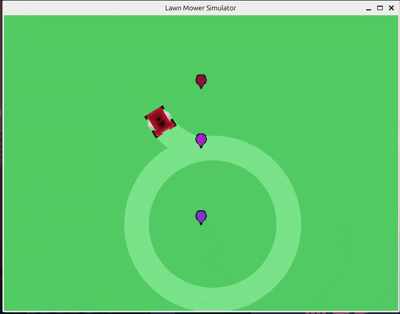
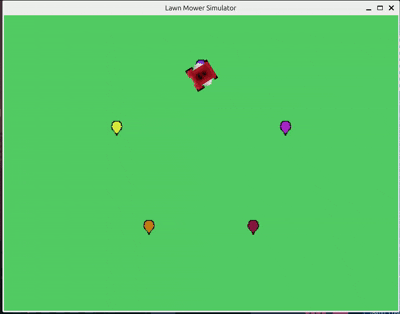
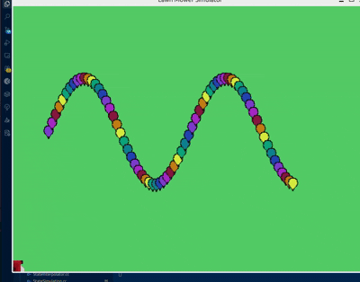

# Mower Simulator | Real-time simulation of a robotic lawn mower 🕹️🚜🍃
[](https://github.com/hbiegacz/mower_simulator/graphs/contributors)
[](https://github.com/hbiegacz/mower_simulator/graphs/commit-activity)
[](https://github.com/hbiegacz/mower_simulator)
[](https://github.com/hbiegacz/mower_simulator)
[](LICENSE)

***Mow Your Way to Coding Mastery***

This simulator is a tool designed to help beginners and students **learn programming and logical thinking** in a fun, visual way. By controlling a virtual robotic lawn mower, users can experiment with algorithms, spatial reasoning, and real-time system control.

### How it works
Take command of the mower's movements using the `controller` object. The application provides a real-time environment where you can observe how your code directly affects the world around you, simulating position, orientation, and mowing paths as you go.

## 📺 Example of a simulation

<table>
  <tr>
    <td align="center"><b>Drawing an 8</b><br/></td>
    <td align="center"><b>Drawing a Star</b><br/></td>
    <td align="center"><b>Drawing a Sine Wave</b><br/></td>
    <td align="center"><b>Drawing a Spiral</b><br/></td>
  </tr>
</table>

## 🛠️ Architecture


....

## ▶️ Running the Simulation
 Dependencies and necesary tools
- **Libraries**: Google Test, Qt5, pthread
- **Tools**: CMake, Make

For a quick setup, please verify the contents of `setup_extra_dependencies.sh` and run it.

In order to start the mower simulator, run:
```
./setup_extra_libraries.sh
mkdir build/
cd build/
cmake ..
make 
./mower_simulator
```
After that you can run tests with the following command:
```
ctest
```
## ✍️ Customizing mower movements
The mower movements can be customized by modifying the `Main.cc` file. There is a special method called 'customUserLogic' in which the user can define the mower's movements using the 'controller' object. 

Aviable commands:
- `move(double cm)`
- `rotate(short deg)`
- `setMowing(bool enable)`
- `addPoint(double x, double y)`
- `deletePoint(unsigned int id)`
- `moveToPoint(unsigned int point_id)`
- `rotateTowardsPoint(unsigned int point_id)`

- `getDistanceToPoint(unsigned int point_id, double& out_distance)`
- `getCurrentAngle(unsigned short& out_angle)`
- `getCurrentPosition(double& out_x, double& out_y)`
> Note: since the commands are queued, the results received from the out_parameters will not be updated until the next command is executed.

Users are also able to customize other simulation parameters, such as the mower's speed and dimensions, as well as the lawn's dimensions.
Another thing that can be customized is the overall simulation speed.


## 💡 Examples of interesting user's programs

**DRAWING A STAR**
```cpp
void customUserLogic(MowerController& controller) {
    
    double cx = LAWN_WIDTH_CM * 0.5;
    double cy = LAWN_LENGTH_CM * 0.5;
    double radius = LAWN_LENGTH_CM * 0.3;
    
    for (int i = 0; i < 5; i++) {
        double angle = (90 - i * 72) * M_PI / 180.0;
        double x = cx + radius * cos(angle);
        double y = cy + radius * sin(angle);
        controller.addPoint(x, y); 
    }
    
    controller.setMowing(false);
    controller.moveToPoint(0);
    controller.setMowing(true);
    
    int drawing_order[] = {2, 4, 1, 3, 0};
    
    for (int i = 0; i < 5; i++) {
        controller.rotateTowardsPoint(drawing_order[i]);
        controller.moveToPoint(drawing_order[i]);
    }
    
    controller.setMowing(false);
    
    for (int i = 4; i >= 0; i--) {
        controller.deletePoint(i);
    }
}

```


**DRAWING AN 8**
```cpp
void customUserLogic(MowerController& controller) {
    
    static double distance_p1_p0 = 0.0;
    static double distance_p1_p2 = 0.0;  
    controller.addPoint(LAWN_WIDTH_CM * 0.5, LAWN_LENGTH_CM * 0.29); // Point 0
    controller.addPoint(LAWN_WIDTH_CM * 0.5, LAWN_LENGTH_CM * 0.55); // Point 1 --- centre of the 8
    controller.addPoint(LAWN_WIDTH_CM * 0.5, LAWN_LENGTH_CM * 0.75); // Point 2

    controller.setMowing(false);
    controller.moveToPoint(1);

    controller.getDistanceToPoint(0, distance_p1_p0);
    controller.getDistanceToPoint(2, distance_p1_p2);


    // DRAWING FIRST CIRCLE
    controller.rotateTowardsPoint(0);
    controller.rotate(90);
    controller.setMowing(true);

    for (double angle = 0; angle < 360; angle += 1) {
        controller.move(&distance_p1_p0, (M_PI / 180.0));
        controller.rotate(-1);
    }

    // DRAWING SECOND CIRCLE
    controller.setMowing(false);
    controller.moveToPoint(1);
    controller.rotateTowardsPoint(2);
    controller.rotate(-90);
    controller.setMowing(true);
    for (double angle = 0; angle < 360; angle += 1) {
        controller.rotate(1);
        controller.move(&distance_p1_p2, (M_PI / 180.0));
    }

    controller.deletePoint(0);
    controller.deletePoint(1);
    controller.deletePoint(2);
}
```
**DRAWING A SINE WAVE**
```cpp
void customUserLogic(MowerController& controller) {
    const int numPoints = 80;  
    double amplitude = LAWN_LENGTH_CM * 0.2;  
    double wavelength = LAWN_WIDTH_CM * 0.8;  
    double centerY = LAWN_LENGTH_CM * 0.5;    
    double startX = LAWN_WIDTH_CM * 0.1;      
    
    for (int i = 0; i < numPoints; i++) {
        double t = static_cast<double>(i) / (numPoints - 1);  
        double x = startX + t * wavelength;
        double y = centerY + amplitude * sin(2 * M_PI * t * 2);  
        
        controller.addPoint(x, y); 
    }
    
    controller.setMowing(false);
    static double distance = 0.0;
    controller.moveToPoint(0);
    controller.setMowing(true);
    
    for (int i = 1; i < numPoints; i++) {
        controller.moveToPoint(i);
    }
    
    for (int i = numPoints - 1; i >= 0; i--) {
        controller.deletePoint(i);
    }
}
```

***Thanks for reading this far! 📖***
